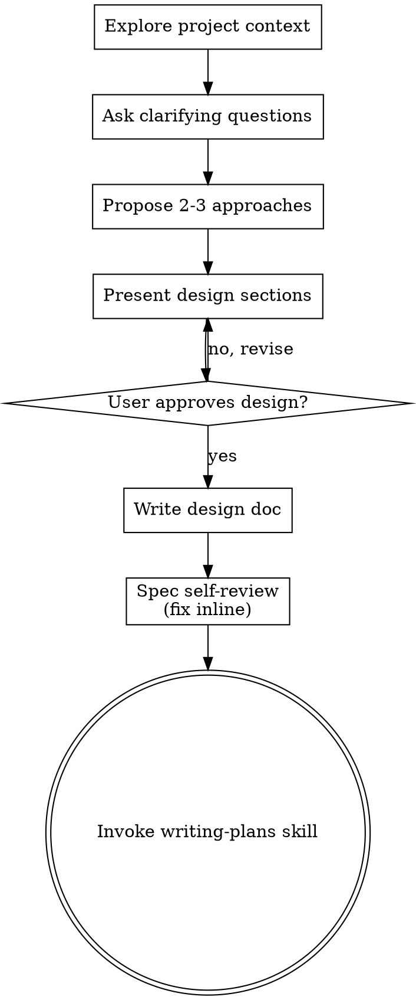

# Brainstorming Ideas Into Designs

> **LANGUAGE: talk to the user in the language from `.agent-kit/project/manifest.yml` → `language`**
> (questions, approaches, design). These skill instructions are in English, but your
> messages to the user follow that language. The spec in docs/specs/ is prose in the
> user's language; code/paths/identifiers are in English.

Help turn ideas into fully formed designs and specs through natural collaborative dialogue.

Start by understanding the current project context, then ask questions one at a time to refine the idea. Once you understand what you're building, present the design and get user approval.

<SINGLE-GATE>
The design approval (below) is the FINAL interactive user checkpoint in the feature flow.
Interaction is front-loaded: the `Task` choice and the optional `Ideate` product brainstorm
come before this, but after design approval there is NO spec-approval gate and NO plan-approval
gate. Once the user approves the design, write the spec, invoke writing-plans, and then
proceed autonomously to implementation per `.agent-kit/rules/autonomous-mode.md`.
</SINGLE-GATE>

<UPSTREAM-IDEATION>
If the `Ideate` step (skill `feature-ideation`) ran before this, a product scope was already
agreed with the user (what's IN, what's deferred to the roadmap). Build the design on that
agreed scope — do NOT re-open settled product decisions. If it was skipped (`--no-ideate` or
the user declined), take the roadmap's scope as given. Either way, this step stays on the
technical layer (HOW), not the product layer (WHAT).
</UPSTREAM-IDEATION>

<HARD-GATE>
Do NOT invoke any implementation skill, write any code, scaffold any project, or take any implementation action until you have presented a design and the user has approved it. This applies to EVERY project regardless of perceived simplicity.
</HARD-GATE>

## Anti-Pattern: "This Is Too Simple To Need A Design"

Every project goes through this process. A todo list, a single-function utility, a config change — all of them. "Simple" projects are where unexamined assumptions cause the most wasted work. The design can be short (a few sentences for truly simple projects), but you MUST present it and get approval.

## Checklist

You MUST create a task for each of these items and complete them in order:

1. **Explore project context** — read `.agent-kit/project/manifest.yml` and load the source docs from
   its `sources` paths (roadmap, idea/product-spec, architecture) — do NOT hardcode
   `docs/…`, take the paths from the manifest. Also check `.agent-kit/engine.md`,
   `.agent-kit/project/instructions.md`, the registered coding-standards source (or the project's actual
   standards file), and recent commits.
2. **Assess feature maturity** — before questioning, judge how well the roadmap/spec
   describes THIS feature (see section below). Sets how deep the design work goes.
3. **Ask clarifying questions** — one at a time, understand purpose/constraints/success criteria. Depth scales to the maturity assessment.
4. **Propose 2-3 approaches** — with trade-offs and your recommendation
5. **Present design + GET USER APPROVAL** — in sections scaled to their complexity, approval after each section. This is the single user gate.
6. **Write design doc** — save to `docs/specs/YYYY-MM-DD-<topic>-design.md` and commit
7. **Spec self-review** — quick inline check for placeholders, contradictions, ambiguity, scope (see below). Fix inline; do NOT ask the user to review it.
8. **Transition to implementation** — invoke the writing-plans skill (no separate approval)

## Process Flow

**The terminal state is invoking writing-plans.** After design approval there are no more user gates — do NOT invoke any other implementation skill, and do NOT stop to ask for spec or plan approval.

## Feature Maturity Assessment (do this first, after loading context)

The manifest guarantees the project is bootstrapped, but the **specific next feature**
may be described richly or barely. Judge it before diving in — does the roadmap/spec say
enough to build this chunk well: what it does, how the user interacts with it, its
"done when", constraints/edge cases?

- **Thinly specified** → warn the user honestly: this feature has too little detail for
  full implementation — let's first work out how this block interacts with the user. Then go
  deeper: more clarifying questions, explore the block's UX/behavior and success criteria
  before proposing approaches. This is the "mini-brainstorm" case.
- **Richly specified** → keep it light: confirm the design quickly and move to the plan. Do
  not manufacture questions the docs already answer.

Scale the depth of everything below to this assessment. The goal is proportional effort: an
unclear feature gets a real work-through, a clear one gets a quick confirmation.

## The Process

**Understanding the idea:**

- Check out the current project state first (files, docs, recent commits)
- Before asking detailed questions, assess scope: if the request describes multiple independent subsystems, flag this immediately. Don't spend questions refining details of a project that needs to be decomposed first.
- If the project is too large for a single spec, help the user decompose into sub-projects: what are the independent pieces, how do they relate, what order should they be built? Then brainstorm the first sub-project through the normal design flow. Each sub-project gets its own spec → plan → implementation cycle.
- For appropriately-scoped projects, ask questions one at a time to refine the idea
- Prefer multiple choice questions when possible, but open-ended is fine too
- Only one question per message - if a topic needs more exploration, break it into multiple questions
- Focus on understanding: purpose, constraints, success criteria
- **Resolve ambiguity now, while the user is present.** Every open decision you leave in the design becomes an autonomous default later (logged in the PR's Assumptions). Push to close important decisions here.

**Exploring approaches:**

- Propose 2-3 different approaches with trade-offs
- Present options conversationally with your recommendation and reasoning
- Lead with your recommended option and explain why

**Presenting the design:**

- Once you believe you understand what you're building, present the design
- Scale each section to its complexity: a few sentences if straightforward, up to 200-300 words if nuanced
- Ask after each section whether it looks right so far
- Cover: architecture, components, data flow, error handling, testing
- Be ready to go back and clarify if something doesn't make sense

**Design for isolation and clarity:**

- Break the system into smaller units that each have one clear purpose, communicate through well-defined interfaces, and can be understood and tested independently
- For each unit, you should be able to answer: what does it do, how do you use it, and what does it depend on?
- Can someone understand what a unit does without reading its internals? Can you change the internals without breaking consumers? If not, the boundaries need work.
- Smaller, well-bounded units are also easier to work with - you reason better about code you can hold in context at once, and your edits are more reliable when files are focused. When a file grows large, that's often a signal that it's doing too much.

**Working in existing codebases:**

- Explore the current structure before proposing changes. Follow the project's registered coding
  standards and existing patterns.
- Where existing code has problems that affect the work (a file that's grown too large, unclear boundaries, tangled responsibilities), include targeted improvements as part of the design - the way a good developer improves code they're working in.
- Don't propose unrelated refactoring. Stay focused on what serves the current goal.

## After the Design

**Documentation:**

- Write the validated design (spec) to `docs/specs/YYYY-MM-DD-<topic>-design.md`
- Commit the design document to git

**Spec Self-Review (autonomous — no user gate):**
After writing the spec document, look at it with fresh eyes and fix inline:

1. **Placeholder scan:** Any "TBD", "TODO", incomplete sections, or vague requirements? Fix them.
2. **Internal consistency:** Do any sections contradict each other? Does the architecture match the feature descriptions?
3. **Scope check:** Is this focused enough for a single implementation plan, or does it need decomposition?
4. **Ambiguity check:** Could any requirement be interpreted two different ways? If so, pick one and make it explicit.

Fix any issues inline, then proceed. Do NOT stop to ask the user to review the spec — the design approval above was the user gate.

**Implementation:**

- Invoke the writing-plans skill to create a detailed implementation plan
- Do NOT invoke any other skill. writing-plans is the next step, and it runs autonomously.

## Key Principles

- **One question at a time** - Don't overwhelm with multiple questions
- **Multiple choice preferred** - Easier to answer than open-ended when possible
- **YAGNI ruthlessly** - Remove unnecessary features from all designs
- **Explore alternatives** - Always propose 2-3 approaches before settling
- **Incremental validation** - Present design, get approval before moving on
- **Final gate** - Design approval is the last user checkpoint (`Task` choice and the optional
  `Ideate` brainstorm come before it); after it, run autonomously
- **Be flexible** - Go back and clarify when something doesn't make sense

<!-- Adapted from Superpowers by Jesse Vincent (MIT). Visual browser companion removed
     (needs a local node server, useless in cloud). Separate spec-review user gate
     removed so the flow has a single interactive checkpoint: design approval. -->
